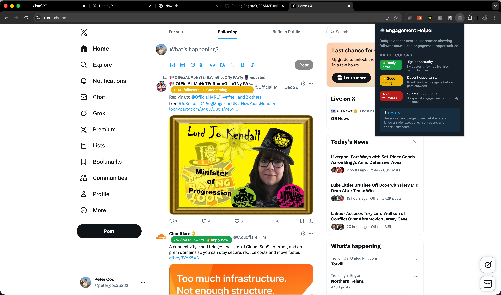

# Twitter Engagement Helper Extension

A Chrome extension that displays follower counts and **engagement opportunity badges** next to usernames on Twitter/X, helping you identify the best times to engage with tweets.



*The extension shows engagement badges (green "Reply now!", yellow "Good timing") next to usernames, with a helpful popup explaining the badge system.*

## Features

- **Follower Count Display**: Shows follower counts next to usernames (e.g., "45,106 followers")
- **Engagement Opportunity Scoring**: Calculates and displays badges indicating when it's a good time to reply
- **Smart Badge Colors**: Visual indicators for high, medium, and low engagement opportunities
- **Real-time Updates**: Works dynamically as you scroll through your Twitter timeline
- **Comprehensive Data Extraction**: Captures user data from regular tweets, retweets, quote tweets, and conversation threads

## Limitations

⚠️ **Important**: This extension **only works on the Twitter homepage** (For You / Following tabs). It does **not** work on:
- User profiles (your own or others')
- Tweet detail pages
- Search results
- Lists
- Bookmarks
- Any other Twitter pages

The extension intercepts the `HomeTimeline` and `HomeLatestTimeline` API endpoints, which are only available on the homepage feed.

## Badge System

### Badge Colors & Meanings

| Badge | Meaning | When to Engage |
|-------|---------|----------------|
| 🟢 **Green: "🔥 Reply now!"** | **High Opportunity** (Score ≥ 50) | Big account, few replies, fresh tweet. Best chance to get noticed! |
| 🟡 **Yellow: "⚡ Good timing"** | **Medium Opportunity** (Score ≥ 35) | Decent window to engage before it gets crowded. |
| 🔴 **Red: Follower count only** | **No Special Opportunity** (Score < 35) | Standard follower count display. No special engagement window detected. |

### Hover Tooltip

Hover over any badge to see detailed stats:
- Username
- Following count
- Follower ratio (followers/following)
- Total tweets
- Reply count
- View count
- Tweet age
- Engagement opportunity score

## Engagement Opportunity Score Calculation

The extension calculates an **Engagement Opportunity Score** for each tweet based on multiple factors:

### Formula

```
Score = FollowerScore - ReplyPenalty + FreshnessBonus + ViewEngagementGap
```

### Components Breakdown

#### 1. **Follower Score** (0-80 points)
```
FollowerScore = log10(followers) × 10
```
- Higher follower count = more visibility if you get noticed
- Logarithmic scale prevents mega-accounts from dominating
- Range: 0-80 points

#### 2. **Reply Penalty** (0-50 points deducted)
```
ReplyPenalty = min(replyCount × 2, 50)
```
- More replies = less opportunity (more competition)
- Capped at 50 to prevent negative scores
- Each reply reduces opportunity by 2 points

#### 3. **Freshness Bonus** (0-30 points)
```
FreshnessBonus = max(0, 30 - (ageInHours))
```
- Recent tweets get a bonus
- Tweets less than 30 hours old get maximum freshness bonus
- Older tweets gradually lose this bonus

#### 4. **View Engagement Gap** (0-20 points)
```
If (replyCount / viewCount < 0.001):  // Less than 0.1% reply rate
  ViewEngagementGap = min(20, log10(viewCount) × 3)
```
- High views but low replies = viral potential with engagement gap
- Indicates tweet is getting attention but not many replies yet
- Great opportunity to jump in early

### Score Thresholds

- **≥ 50**: 🟢 Green badge - "🔥 Reply now!"
- **≥ 35**: 🟡 Yellow badge - "⚡ Good timing"
- **< 35**: 🔴 Red badge - Follower count only

### Example Calculations

**High Opportunity Tweet:**
- 100K followers → FollowerScore: 50
- 5 replies → ReplyPenalty: 10
- 2 hours old → FreshnessBonus: 28
- 50K views, 5 replies → ViewEngagementGap: 15
- **Total Score: 83** → 🟢 Green badge

**Medium Opportunity Tweet:**
- 10K followers → FollowerScore: 40
- 15 replies → ReplyPenalty: 30
- 5 hours old → FreshnessBonus: 25
- 5K views, 15 replies → ViewEngagementGap: 0
- **Total Score: 35** → 🟡 Yellow badge

**Low Opportunity Tweet:**
- 1K followers → FollowerScore: 30
- 50 replies → ReplyPenalty: 50
- 48 hours old → FreshnessBonus: 0
- 2K views, 50 replies → ViewEngagementGap: 0
- **Total Score: -20** (clamped to 0) → 🔴 Red badge

## Development

### Setup

```bash
npm install
```

### Build

```bash
npm run build
```

This will create a `dist` folder with the compiled extension.

### Development Mode

```bash
npm run dev
```

This will watch for changes and rebuild automatically.

## Icon Setup

Before building, you need to generate PNG icons from the SVG source:

1. Navigate to `src/icons/`
2. See `src/icons/README.md` for detailed instructions
3. Quick method: Use an online SVG to PNG converter or ImageMagick:
   ```bash
   # Generate all sizes from icon.svg
   convert -background none src/icons/icon.svg -resize 16x16 src/icons/icon-16.png
   convert -background none src/icons/icon.svg -resize 32x32 src/icons/icon-32.png
   convert -background none src/icons/icon.svg -resize 48x48 src/icons/icon-48.png
   convert -background none src/icons/icon.svg -resize 128x128 src/icons/icon-128.png
   ```

**Note**: The extension will work without icons, but Chrome will show a default icon. For a polished look, generate the PNG files.

## Installation

1. Generate icons (see above)
2. Build the extension: `npm run build`
3. Open Chrome and navigate to `chrome://extensions/`
4. Enable "Developer mode" (toggle in top right)
5. Click "Load unpacked"
6. Select the `dist` folder

## How It Works

### Data Extraction

1. **API Interception**: Intercepts Twitter GraphQL API requests (`HomeTimeline` and `HomeLatestTimeline`)
2. **Data Parsing**: Extracts user and tweet data from:
   - Regular tweets
   - Retweets (original author)
   - Quote tweets (quoted author)
   - Conversation threads (`TimelineTimelineModule`)
3. **Score Calculation**: Computes engagement opportunity score for each tweet
4. **Badge Injection**: Injects badges next to usernames in the DOM

### Technical Details

- **Content Script**: Intercepts `fetch` and `XMLHttpRequest` calls
- **MutationObserver**: Watches for new tweet cards as you scroll
- **Case-Insensitive Matching**: Handles username variations (e.g., `W_Terrence` vs `w_terrence`)
- **Real-time Processing**: Processes new tweets as they appear

## Debugging

### Console Commands

```javascript
// Get comprehensive matching report
debugEngageX()

// Shows:
// - All cards in DOM vs API data
// - Matched usernames
// - Missing usernames (in DOM but not in API)
// - All extracted usernames
```

### Console Logs

The extension logs:
- `✅ Timeline intercepted` - When API calls are captured
- `✅ Extracted X users, Y tweets` - Data extraction summary
- `📋 All usernames found in API response` - Complete username list
- `⚠️ Found X usernames in API that weren't extracted` - Parsing issues
- `🔥 High engagement opportunities` - Top 5 best tweets to engage with

## Project Structure

```
src/
  ├── content/
  │   ├── index.ts                    # Main content script
  │   ├── helpers.ts                  # Data mapping & score calculation
  │   ├── inject-card-elements/
  │   │   └── index.ts                # Badge injection logic
  │   └── HomeTimeline.json          # Sample API response (For You tab)
  │   └── HomeLatestTimeline.json    # Sample API response (Following tab)
  ├── manifest.json                    # Chrome extension manifest
  └── popup.html                      # Extension popup with badge legend
```

## Notes

- The extension intercepts both `HomeTimeline` (For You) and `HomeLatestTimeline` (Following) endpoints
- Follower counts are extracted from `legacy.followers_count` field
- Engagement scores are recalculated when new API data arrives
- Some tweets may not have badges if they come from different API endpoints (ads, promoted tweets, etc.)

## License

MIT

